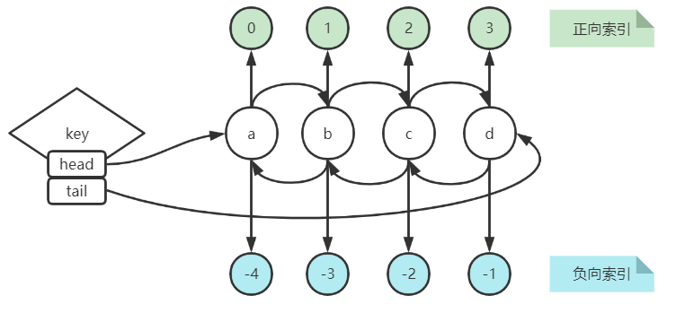

# List

一个双端链表的结构，容量是 2^32^-1 个元素，主要功能有push/pop等，一般用在栈、队列、消息队列等场景。



‍

‍

## LPUSH

```shell
LPUSH key value [value ...]
```

将一个或多个值 **value** 插入到列表 **key** 的表头（最左边）。

如果有多个 **value** 值，那么各个 **value** 值按从左到右的顺序依次插入到表头。例如：

```shell
LPUSH mylist a b c d
列表的值将是: d c b a
```

如果 **key** 不存在，一个空列表会被创建并执行 `LPUSH`操作。

当 **key** 存在但不是列表类型时，返回一个错误。

### 可用版本

```shell
>= 1.0.0
```

### 返回值

执行`LPUSH`命令后，列表的长度。

## LPUSHX

```shell
LPUSHX key value
```

将值 **value** 插入到列表 **key** 的表头，当且仅当 **key** 存在并且是一个列表。

当 **key** 不存在时，`LPUSHX` 命令什么也不做。

### 可用版本

```shell
>= 2.2.0
```

### 返回值

执行`LPUSHX`命令后，列表的长度。

## RPUSH

```shell
RPUSH key value [value ...]
```

将一个或多个值 **value** 插入到列表 **key** 的表尾（最右边）。

如果有多个 **value** 值，那么各个 **value** 值按从左到右的顺序依次插入到表尾。例如：

```shell
RPUSH mylist a b c d
列表的值将是: a b c d
```

如果 **key** 不存在，一个空列表会被创建并执行 `RPUSH`操作。

当 **key** 存在但不是列表类型时，返回一个错误。

### 可用版本

```shell
>= 1.0.0
```

### 返回值

执行`RPUSH`命令后，列表的长度。

## RPUSHX

```shell
RPUSHX key value
```

将值 **value** 插入到列表 **key** 的表尾，当且仅当 **key** 存在并且是一个列表。

当 **key** 不存在时，`RPUSHX` 命令什么也不做。

### 可用版本

```shell
>= 2.2.0
```

### 返回值

执行`RPUSHX`命令后，列表的长度。

## LPOP

```shell
LPOP key
```

移除并返回列表 **key** 的头元素。

### 可用版本

```shell
>= 1.0.0
```

### 返回值

列表的头元素。当 **key** 不存在时，返回 **nil** 。

## RPOP

```shell
RPOP key
```

移除并返回列表 **key** 的尾元素。

### 可用版本

```shell
>= 1.0.0
```

### 返回值

列表的尾元素。当 **key** 不存在时，返回 **nil** 。

## RPOPLPUSH

```shell
RPOPLPUSH source destination
```

命令 `RPOPLPUSH`在一个原子时间内，执行以下两个动作：

* 将列表 **source** 中的最后一个元素(尾元素)弹出，并返回给客户端。
* 将 **source** 弹出的元素插入到列表 **destination** ，作为 **destination** 列表的的头元素。

如果 **source** 不存在，值 **nil** 被返回，并且不执行其他动作。

如果 **source** 和 **destination** 相同，则列表中的表尾元素被移动到表头，并返回该元素，可以把这种特殊情况视作列表的旋转(rotation)操作。

### 可用版本

```shell
>= 1.2.0
```

### 返回值

被弹出的元素。

## 示例

```shell
# source 和 destination 不同
127.0.0.1:6380> lrange k1 0 -1
1) "a"
2) "b"
3) "c"
4) "d"
127.0.0.1:6380> rpoplpush k1 k2
"d"
127.0.0.1:6380> lrange k2 0 -1
1) "d"

# source 和 destination 相同

127.0.0.1:6380> lrange k1 0 -1
1) "a"
2) "b"
3) "c"
4) "d"
127.0.0.1:6380> rpoplpush k1 k1
"d"
127.0.0.1:6380> lrange k1 0 -1
1) "d"                             # d 被旋转到了表头
2) "a"
3) "b"
4) "c"


```

## LLEN

```shell
LLEN key
```

返回列表 **key** 的长度。

如果 **key** 不存在，则 **key** 被解释为一个空列表，返回 **0** 。

如果 **key** 不是列表类型，返回一个错误。

### 可用版本

```shell
>= 1.0.0
```

### 返回值

列表 **key** 的长度。

## LRANGE

```shell
LRANGE key start stop
```

返回列表 **key** 中指定区间内的元素，区间以偏移量 **start** 和 **stop** 指定下标说明[^下标说明]。

L**RANGE命令的区间：**

假如你有一个包含一百个元素的列表，对该列表执行 **LRANGE list 0 10** ，结果是一个包含11个元素的列表，这表明 **stop** 下标也在 LRANGE 命令的取值范围之内(闭区间)。

**超出范围的下标**

**超出范围的下标值不会引起错误。**

* 如果 **start** 下标比列表的最大下标 **end** ( **LLEN** **list** 减去 **1** )还要大，那么 `LRANGE`返回一个空列表。
* 如果 **stop** 下标比 **end** 下标还要大，Redis将 **stop** 的值设置为 **end** 。

### 可用版本

```shell
>= 1.0.0
```

### 返回值

一个列表，包含指定区间内的元素。

## LINDEX

```shell
LINDEX key index
```

返回列表 **key** 中，下标为 **index**[^下标说明])的元素。

如果 **key** 不是列表类型，返回一个错误。

### 可用版本

```shell
>= 1.0.0
```

### 返回值

列表中下标为 **index** 的元素。如果 **index** 参数的值不在列表的区间范围内(out of range)，返回 **nil** 。

## LSET

```shell
LSET key index value
```

将列表 **key** 下标为 **index**[^下标说明]的元素的值设置为 **value** 。

当 **index** 参数超出范围，或对一个空列表( **key** 不存在)进行 `LSET` 时，返回一个错误。

### 可用版本

```shell
>= 1.0.0
```

### 返回值

操作成功返回 **ok** ，否则返回错误信息。

## LREM

```shell
LREM key count value
```

根据参数 **count** 的值，移除列表中与参数 **value** 相等的元素。

**count** 的值可以是以下几种：

* **count** **&gt;** **0** : 从表头开始向表尾搜索，移除与 **value** 相等的元素，数量为 **count** 。
* **count** **&lt;** **0** : 从表尾开始向表头搜索，移除与 **value** 相等的元素，数量为 **count** 的绝对值。
* **count** **=** **0** : 移除表中所有与 **value** 相等的值。

### 可用版本

```shell
>= 1.0.0
```

### 返回值

被移除元素的数量。因为不存在的 **key** 被视作空表(empty list)，所以当 **key** 不存在时， `LREM` 命令总是返回 **0** 。

## LINSERT

```shell
LINSERT key BEFORE|AFTER pivot value
```

将值 **value** 插入到列表 **key** 当中，位于值 **pivot** 之前或之后。

当 **pivot** 不存在于列表 **key** 时，不执行任何操作。

当 **key** 不存在时， **key** 被视为空列表，不执行任何操作。

如果 **key** 不是列表类型，返回一个错误。

### 可用版本

```shell
>= 2.2.0
```

### 返回值

如果命令执行成功，返回插入操作完成之后，列表的长度。

如果没有找到 **pivot** ，返回 **-1** 。

如果 **key** 不存在或为空列表，返回 **0** 。

## LTRIM

```shell
LTRIM key start stop
```

对一个列表进行修剪(trim)，就是说，让列表只保留指定区间内的元素，不在指定区间之内的元素都将被删除[^下标说明]。

当 **key** 不是列表类型时，返回一个错误。

**L**​**TRIM**​**命令的区间：**

假如你有一个包含一百个元素的列表，对该列表执行 **LTRIM list 0 10** ，结果是一个包含11个元素的列表，这表明 **stop** 下标也在 LTRIM 命令的取值范围之内(闭区间)。

**超出范围的下标**

**超出范围的下标值不会引起错误。**

* 如果 **start** 下标比列表的最大下标 **end** ( **LLEN** **list** 减去 **1** )还要大，或者 **start** **&gt;** **stop**，那么 LTRIM 返回一个空列表。(因为 [LTRIM](http://doc.redisfans.com/list/ltrim.html#ltrim) 已经将整个列表清空)。
* 如果 **stop** 下标比 **end** 下标还要大，Redis将 **stop** 的值设置为 **end** 。

### 可用版本

```shell
>= 1.0.0
```

### 返回值

命令执行成功时，返回 **ok** 。

## BLPOP

```shell
BLPOP key [key ...] timeout
```

`BLPOP` 是列表的阻塞式(blocking)弹出原语。

它是 `LPOP` 命令的阻塞版本，当给定列表内没有任何元素可供弹出的时候，连接将被 `BLPOP` 命令阻塞，直到等待超时或发现可弹出元素为止。

当给定多个 **key** 参数时，按参数 **key** 的先后顺序依次检查各个列表，弹出第一个非空列表的头元素。

**非阻塞行为**

当 `BLPOP` 被调用时，如果给定 **key** 内至少有一个非空列表，那么弹出遇到的第一个非空列表的头元素，并和被弹出元素所属的列表的名字一起，组成结果返回给调用者。

当存在多个给定 **key** 时，`BLPOP` 按给定 **key** 参数排列的先后顺序，依次检查各个列表。

### 可用版本

```shell
>= 2.2.0
```

### 返回值

如果列表为空，返回一个 **nil** 。否则，返回一个含有两个元素的列表，第一个元素是被弹出元素所属的 **key** ，第二个元素是被弹出元素的值。

## 示例

```shell
# 阻塞行为
# key k1不存在， 三个客户端，分别连接6380服务器
# 客户端1、客户端2分别执行 blpop k1 0 命令，均处于阻塞状态
127.0.0.1:6380> blpop k1 0

# 客户端3 执行push操作

127.0.0.1:6380> lpush k1 a
(integer) 1

# 客户端1输出
127.0.0.1:6380> blpop k1 0
1) "k1"
2) "a"
(43.82s)
127.0.0.1:6380>

# 客户端3 再次执行push操作

127.0.0.1:6380> lpush k1 a
(integer) 1

# 客户端2输出
127.0.0.1:6380> blpop k1 0
1) "k1"
2) "b"
(26.89s)
127.0.0.1:6380>
```

## BRPOP

```shell
BRPOP key [key ...] timeout列表的阻塞式(blocking)弹出原语。
```

`BRPOP` 是列表的阻塞式(blocking)弹出原语。

它是 `RPOP` 命令的阻塞版本，当给定列表内没有任何元素可供弹出的时候，连接将被 `BRPOP` 命令阻塞，直到等待超时或发现可弹出元素为止。

当给定多个 **key** 参数时，按参数 **key** 的先后顺序依次检查各个列表，弹出第一个非空列表的尾部元素。

`BRPOP` 除了弹出元素的位置和 `BRPOP` 不同之外，其他表现一致。

### 可用版本

```shell
>= 2.2.0
```

### 返回值

假如在指定时间内没有任何元素被弹出，则返回一个 **nil** 和等待时长。反之，返回一个含有两个元素的列表，第一个元素是被弹出元素所属的 **key** ，第二个元素是被弹出元素的值。

## BRPOPLPUSH

```shell
BRPOPLPUSH source destination timeout
```

`BRPOPLPUSH`是 `RPOPLPUSH` 的阻塞版本，当给定列表 **source** 不为空时， `BRPOPLPUSH`的表现和 `RPOPLPUSH` 一样。

当列表 **source** 为空时，`BRPOPLPUSH`命令将阻塞连接，直到等待超时，或有另一个客户端对 **source** 执行 `LPUSH` 或 `RPUSH` 命令为止。

超时参数 **timeout** 接受一个以秒为单位的数字作为值。超时参数设为 **0** 表示阻塞时间可以无限期延长(block indefinitely) 。

其他相关信息，可参考 `RPOPLPUSH` 命令。

### 可用版本

```shell
>= 2.2.0
```

### 返回值

假如在指定时间内没有任何元素被弹出，则返回一个 **nil** 和等待时长。反之，返回一个含有两个元素的列表，第一个元素是被弹出元素的值，第二个元素是等待时长。

## 应用场景

* 微信公众号订阅的消息

  ```shell
  例如订阅了多个公众号，如果有公众号发布文章，都会推送到我的订阅消息中：lpush userId articleId1 articleId2
  ```
* 商品评论列表

  ```shell
  key是该商品的id，value是商品评论信息。
  例如：商品编号为1001的商品评论key为【items:comment:1001】，lpush items:comment:1001 productComment
  ```

## 脚注

[^下标说明]:下标(index)参数 **start** 和 **stop** 都以 **0** 为底，也就是说，以 **0** 表示列表的第一个元素，以 **1** 表示列表的第二个元素，以此类推。负数下标表示，以 **-1** 表示列表的最后一个元素， **-2** 表示列表的倒数第二个元素，以此类推。

