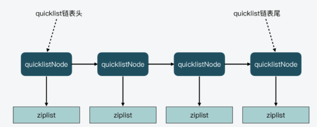

# QuickList存储结构

Redis3.2 之后，列表对象使用`quicklist`实现。

**ziplist 的优缺点：**

* 优点： 存储在一段连续的内存上，不容易产生内存碎片，内存利用率高。
* 缺点：插入和删除操作需要频繁的申请和释放内存。当 ziplist 长度很长时，会导致大批量的数据拷贝。

**linkedlist 的优缺点：**

* 优点：插入，删除节点复杂度低
* 缺点：每个节点上除了要保存数据之外还要额外保存 prev, next 两个指针，内存开销大；各个节点是单独的内存块，地址不连续，节点多了容易产生内存碎片。

在 Redis3.2 之后， `quicklist`就产生了，它的设计思想很简单，就是将一个长`ziplist`拆分为多个短`ziplist`，避免插入或删除元素时导致大量的内存拷贝。

但是，到底一个`quicklist`节点包含多长的`ziplist`合适呢？怎么平衡那？

* ziplist越短，内存碎片越多。
* ziplist越长，分配大块连续内存空间的难度就越大。

Redis 提供了一个配置参数`list-max-ziplist-size`（默认值为：**2**），可以来根据自己的情况进行调整。

* 取正值：表示按照**数据项个数**来限定每个**quicklist**节点上的**ziplist**长度。
* 取负值：表示按照`占用字节数`来限定每个`quicklist`节点上的`ziplist`长度，但是只能取 **-1** 到 **-5** 这五个值。

  * -5: 每个`quicklist`节点上的`ziplist`大小不能超过64 Kb。（注：1kb => 1024 bytes）
  * -4: 每个`quicklist`节点上的`ziplist`大小不能超过32 Kb。
  * -3: 每个`quicklist`节点上的`ziplist`大小不能超过16 Kb。
  * -2: 每个`quicklist`节点上的`ziplist`大小不能超过8 Kb。（-2是Redis给出的默认值）
  * -1: 每个`quicklist`节点上的`ziplist`大小不能超过4 Kb。

**quicklist内部存储结构**

每个 `quicklist.h/quicklistNode` 结构表示一个节点：

```c

typedef struct quicklistNode {
    struct quicklistNode *prev;// 指向前一个节点
    struct quicklistNode *next;// 指向后一个节点
    unsigned char *zl;//quicklistNode指向的ziplist
    unsigned int sz;// ziplist 占用的字节数
    unsigned int count : 16;// ziplist中存储的元素个数，16字节(最大65535个)
    unsigned int encoding : 2; //压缩算法 RAW==1 or LZF==2 
    unsigned int container : 2; //存储结构 NONE==1 or ZIPLIST==2
    unsigned int recompress : 1; // 数据是否被压缩
    unsigned int attempted_compress : 1;//数据能否被压缩
    unsigned int extra : 10; //预留的bit位
} quicklistNode;

```

每个 `quicklist.h/quicklist` 结构由多个`quicklistNode`节点构成：

```c
typedef struct quicklist {
    quicklistNode *head;// 头节点
    quicklistNode *tail;// 尾节点
    unsigned long count;// ziplist 中一共存储了多少元素
    unsigned long len; // 双向链表的长度，即 quicklistNode 的数量
    int fill : 16;// 填充因子
    unsigned int compress : 16;// 压缩深度 0-不压缩
} quicklist;

```

从`quicklistNode`和`quicklist`的结构体定义中，我们就能画出下面这张 quicklist 的示意图。


