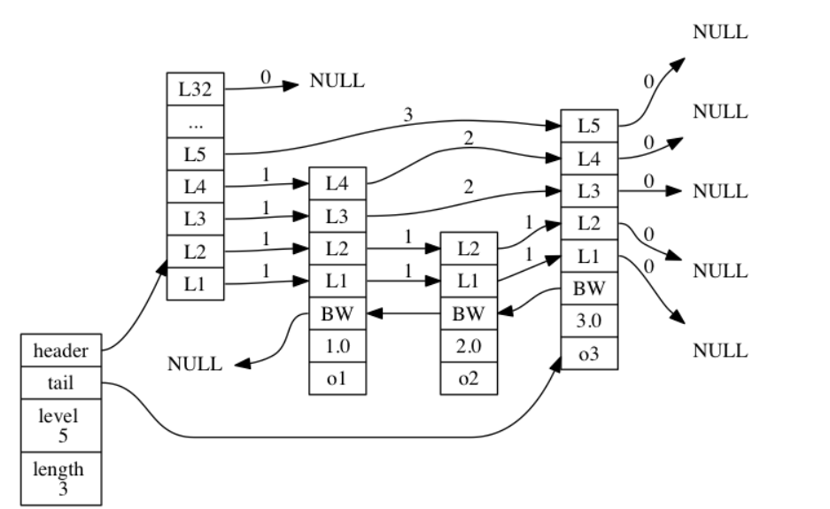

# SortSet存储结构

**Sortedset** 同时会由两种数据结构支持，`ziplist`和`skiplist`。

每个 entry 都是由 score + member 组成。

## 存储结构的选择

只有同时满足如下条件是,使用的是`ziplist`，其他时候则是使用`skiplist`

* 服务器属性 `server.zset_max_ziplist_entries` 的值大于 **0** （默认为 **128** 个）。
* 元素的 **member** 长度小于服务器属性 `server.zset_max_ziplist_value` 的值（默认为 64字节 ）。

## 存储结构的转换

对于一个 `REDIS_ENCODING_ZIPLIST` 的有序集， 只要满足以下任一条件， 就将它转换为 `REDIS_ENCODING_SKIPLIST` 的存储：

* `ziplist` 所保存的元素数量超过服务器属性 `server.zset_max_ziplist_entries` 的值（默认为 **128** 个）
* 新添加元素的 **member**  的长度大于服务器属性 `server.zset_max_ziplist_value` 的值（（默认为 64字节 ）。

## ZIPLIST

每个有序集元素以两个相邻的 `ziplist`节点表示， 第一个节点保存元素的 **member** 域， 第二个元素保存元素的 **score** 域。

多个元素之间按 **score** 值从小到大排序， 如果两个元素的 **score** 相同， 那么按["字典序"](siyuan://blocks/20220220144618-3rkgma4)对 **member** 进行对比， 决定那个元素排在前面， 那个元素排在后面。

```shell
          |<--  element 1 -->|<--  element 2 -->|<--   .......   -->|

+---------+---------+--------+---------+--------+---------+---------+---------+
| ZIPLIST |         |        |         |        |         |         | ZIPLIST |
| ENTRY   | member1 | score1 | member2 | score2 |   ...   |   ...   | ENTRY   |
| HEAD    |         |        |         |        |         |         | END     |
+---------+---------+--------+---------+--------+---------+---------+---------+

score1 <= score2 <= ...
```

虽然元素是按 **score** 域有序排序的， 但对 `ziplist`的节点指针只能线性地移动， 所以在 `REDIS_ENCODING_ZIPLIST`存储的有序集中， 查找某个给定元素的复杂度为 **O(N)** 。

每次执行添加/删除/更新操作都需要执行一次查找元素的操作， 因此这些函数的复杂度都不低于 **O(N)** ， 至于这些操作的实际复杂度， 取决于它们底层所执行的 `ziplist`操作。

## SKIPLIST

Redis 的跳跃表由 `redis.h/zskiplistNode` 和 `redis.h/zskiplist` 两个结构定义， 其中 `zskiplistNode` 结构用于表示跳跃表节点， 而 `zskiplist` 结构则用于保存跳跃表节点的相关信息， 比如节点的数量， 以及指向表头节点和表尾节点的指针， 等等。



图片最左边的是 `zskiplist` 结构， 该结构包含以下属性：

* **header** ：指向跳跃表的表头节点。
* **tail** ：指向跳跃表的表尾节点。
* **level** ：记录目前跳跃表内，层数最大的那个节点的层数（表头节点的层数不计算在内）。
* **length** ：记录跳跃表的长度，也即是，跳跃表目前包含节点的数量（表头节点不计算在内）。

位于 `zskiplist` 结构右方的是四个 `zskiplistNode` 结构， 该结构包含以下属性：

* 层（level）：节点中用 `L1`、`L2`、`L3` 等字样标记节点的各个层， `L1`代表第一层， `L2` 代表第二层，以此类推。

  每个层都带有两个属性：前进指针和跨度。前进指针用于访问位于表尾方向的其他节点，而跨度则记录了前进指针所指向节点和当前节点的距离。

  在上面的图片中，连线上带有数字的箭头就代表前进指针，而那个数字就是跨度。当程序从表头向表尾进行遍历时，访问会沿着层的前进指针进行。
* 后退（backward）指针：节点中用 `BW` 字样标记节点的后退指针，它指向位于当前节点的前一个节点。后退指针在程序从表尾向表头遍历时使用。
* 分值（score）：各个节点中的 `1.0` 、 `2.0` 和 `3.0` 是节点所保存的分值。在跳跃表中，节点按各自所保存的分值从小到大排列。
* 成员对象（obj）：各个节点中的 `o1` 、 `o2` 和 `o3` 是节点所保存的成员对象。

## 参考书籍

[Redis 设计与实现](http://redisbook.com/)

‍
