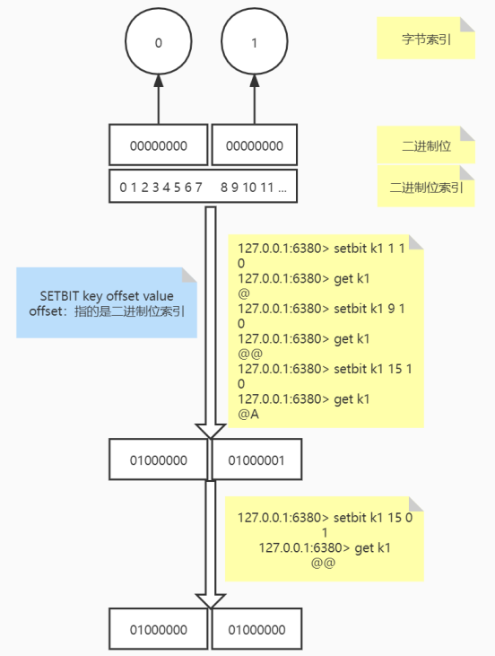
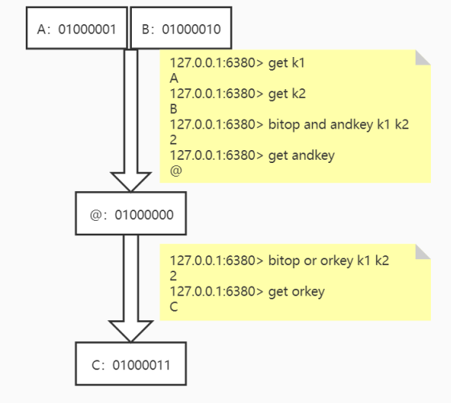

# String

根据**String命令对 value 的操作，可以将 String 命令分为三种类型：**

1. 字符串：SET、GET、GETSET、MSET、MSETNX、MGET、SETRANGE、GETRANGE、APPEND、STRLEN
2. 数值：INCR、INCRBY、INCRBYFLOAT、DECR、DECRBY
3. bitmap：SETBIT、GETBIT、BITCOUNT、BITOP、BITPOS

## SET

```shell
SET key value [EX seconds] [PX milliseconds] [NX|XX]
```

将字符串值 **value** 关联到 **key** 。

如果 **key** 已经持有其他值，`SET`就覆写旧值，无视类型。

对于某个原本带有生存时间（TTL）的键来说， 当 `SET` 命令成功在这个键上执行时， 这个键原有的 TTL 将被清除。

### 可选参数

* **EX** **second** ：设置键的过期时间为 **second** 秒。 **SET** **key** **value** **EX** **second** 效果等同于 **SETEX** **key** **second** **value** 。
* **PX** **millisecond** ：设置键的过期时间为 **millisecond** 毫秒。 **SET** **key** **value** **PX** **millisecond** 效果等同于 **PSETEX** **key** **millisecond** **value** 。
* **NX** ：只在键不存在时，才对键进行设置操作。 **SET** **key** **value** **NX** 效果等同于 **SETNX** **key** **value** 。
* **XX** ：只在键已经存在时，才对键进行设置操作。

### 可用版本

```shell
>= 1.0.0
```

### 返回值

在 Redis 2.6.12 版本以前， `SET`命令总是返回 OK 。

从 Redis 2.6.12 版本开始， `SET`在设置操作成功完成时，才返回 OK 。  
如果设置了 NX 或者 XX ，但因为条件没达到而造成设置操作未执行，那么命令返回空批量回复（NULL Bulk Reply）。

## GET

```shell
GET key
```

返回与键 **key** 相关联的字符串值。

### 可用版本

```shell
>= 1.0.0
```

### 返回值

当 **key** 不存在时，返回 **nil** ，否则，返回 **key** 的值。

如果 **key** 不是字符串类型，那么返回一个错误，因为 `GET` 只能用于处理字符串值。

## GETSET

```shell
GETSET key value
```

将给定 **key** 的值设为 **value** ，并返回 **key** 的旧值(old value)。

### 可用版本

```shell
>= 1.0.0
```

### 返回值

返回给定键 **key** 的旧值。

如果键 **key** 在被设置之前并不存在， 那么命令返回 **nil** ；如果键 **key**  存在但不是字符串类型时， 命令返回一个错误。

## MSET

```shell
MSET key value [key value ...]
```

同时设置一个或多个 **k-v** 键值对。

如果某个给定 key 已经存在，那么 `MSET` 会用新值覆盖原来的旧值。

`MSET` 是一个原子性(atomic)操作， 所有给定键都会在同一时间内被设置， 不会出现某些键被设置了但是另一些键没有被设置的情况。

### 可用版本

```shell
>= 1.0.1
```

### 返回值

`MSET` 命令总是返回 `OK` 。

## MSETNX

```shell
MSETNX key value [key value ...]
```

当且仅当所有给定 **key** 都不存在时， 为所有给定 key 设置值。

即使只有一个给定 **key** 已存在，`MSETNX`也会拒绝执行所有给定 **key** 的设置操作。

`MSETNX`是原子性的，因此它可以用作设置多个不同 **key** 表示不同字段(field)的唯一性逻辑对象(unique logic object)，所有字段要么全被设置，要么全不被设置。

### 可用版本

```shell
>= 1.0.1
```

### 返回值

当所有 **key** 都设置成功，返回 **1** ； 如果因为某个给定 **key** 已经存在而导致设置未能成功执行， 那么返回 **0**。

## MGET

```shell
MGET key [key ...]
```

返回所有(一个或多个)给定 **key** 的值。

如果给定的 **key** 里面，有某个 **key** 不存在，那么这个 **key** 返回特殊值 **nil** 。

### 可用版本

```shell
>= 1.0.0
```

### 返回值

返回一个列表， 列表中包含了所有给定 key 的值。

## SETRANGE

```shell
SETRANGE key offset value
```

从偏移量 **offset**（从 **0** 开始） 开始，用 **value** 参数覆写(overwrite)给定 **key** 所储存的字符串值。

不存在的 **key** 当作空白字符串处理。

`SETRANGE`命令会确保字符串足够长以便将 **value** 设置在指定的偏移量上，如果给定 **key** 原来储存的字符串长度比偏移量小(比如字符串只有 **5** 个字符长，但你设置的 **offset** 是 **10** )，那么原字符和偏移量之间的空白将用零字节(zerobytes, **&quot;\x00&quot;** )来填充。

因为 Redis 字符串的大小被限制在 512 兆(megabytes)以内， 所以用户能够使用的最大偏移量为 2^29-1(536870911)，如果需要使用比这更大的空间， 请使用多个 **key**。

Warning：当生成一个很长的字符串时， Redis 需要分配内存空间， 该操作有时候可能会造成服务器阻塞(block)。

### 可用版本

```shell
>= 2.2.0
```

### 返回值

返回被修改之后， 字符串值的长度。

## GETRANGE

```shell
GETRANGE key start end
```

返回 **key** 中字符串值的子字符串，字符串的截取范围由 **start** 和 **end** 两个偏移量(从 **0** 开始)决定(包括 **start** 和 **end** 在内)。

负数偏移量表示从字符串最后开始计数， **-1** 表示最后一个字符， **-2** 表示倒数第二个，以此类推。

`GETRANGE`通过保证子字符串的值域(range)不超过实际字符串的值域来处理超出范围的值域请求。

`GETRANGE`不支持回绕操作，例如：

```shell
127.0.0.1:6379> set k1 123456789
OK
127.0.0.1:6379> getrange k1 1 5
23456
127.0.0.1:6379> getrange k1 -1 -5

127.0.0.1:6379> getrange k1 -5 -1
56789
```

### 可用版本

```shell
>= 2.4.0
```

### 返回值

返回字符串值的指定部分。

## APPEND

```shell
APPEND key value
```

如果 **key** 已经存在并且是一个字符串，`APPEND`命令将 **value** 追加到 **key** 原来的值的末尾。

如果 **key** 不存在，`APPEND` 将给定 **key** 设为 **value** ，就像执行 **SET** **key** **value** 一样。

### 可用版本

```shell
>= 2.0.0
```

### 返回值

追加 **value** 之后， **key** 中字符串的长度。

## STRLEN

```shell
STRLEN key
```

返回 **key** 所储存的字符串值的长度。

### 可用版本

```shell
>= 2.2.0
```

### 返回值

`STRLEN` 命令返回字符串值的长度。

当键 **key** 不存在时， 命令返回 **0**；当 **key** 储存的不是字符串值时， 返回一个错误。

## INCR

```shell
INCR key
```

将 **key** 中储存的数字值增一。

如果 **key** 不存在，那么 **key** 的值会先被初始化为 **0** ，然后再执行`INCR`操作。

如果值包含错误的类型，或字符串类型的值不能表示为数字，那么返回一个错误。

本操作的值限制在 64 位(bit)有符号数字表示之内。

> `INCR`命令是一个针对字符串的操作。 因为 Redis 并没有专用的整数类型， 所以键 `INCR`储存的值在执行 `INCR`命令时会被解释为十进制 64 位有符号整数。

### 可用版本

```shell
>= 1.0.0
```

### 返回值

返回键 **key** 在执行**加一**操作之后的值。

## INCRBY

```shell
INCRBY key increment
```

将 **key** 所储存的值加上增量 **increment** 。

如果 **key** 不存在，那么 **key** 的值会先被初始化为 **0** ，然后再执行`INCRBY`命令。

如果值包含错误的类型，或字符串类型的值不能表示为数字，那么返回一个错误。

### 可用版本

```shell
>= 1.0.0
```

### 返回值

在加上增量 **increment** 之后， 键 **key** 的值。

## INCRBYFLOAT

```shell
INCRBYFLOAT key increment
```

为 **key** 中所储存的值加上浮点数增量 **increment** 。

如果 **key** 不存在，那么`INCRBYFLOAT`会先将 **key** 的值设为 **0** ，再执行加法操作。

如果命令执行成功，那么 **key** 的值会被更新为（执行加法之后的）新值，并且新值会以字符串的形式返回给调用者。

无论是 **key** 的值，还是增量 **increment** ，都可以使用像 **2.0e7** 、 **3e5** 、 **90e-2** 那样的指数符号(exponential notation)来表示，但是，**执行 INCRBYFLOAT 命令之后的值**总是以同样的形式储存，也即是，它们总是由一个数字，一个（可选的）小数点和一个任意位的小数部分组成（比如 **3.14** 、 **69.768** ，诸如此类)，小数部分尾随的 **0** 会被移除，如果有需要的话，还会将浮点数改为整数（比如 **3.0** 会被保存成 **3** ）。

除此之外，无论加法计算所得的浮点数的实际精度有多长，`INCRBYFLOAT`的计算结果也最多只能表示小数点的后十七位。

当以下任意一个条件发生时，返回一个错误：

* **key** 的值不是字符串类型(因为 Redis 中的数字和浮点数都以字符串的形式保存，所以它们都属于字符串类型）
* **key** 当前的值或者给定的增量 **increment** 不能解释(parse)为双精度浮点数(double precision floating point number）

### 可用版本

```shell
>= 2.6.0
```

### 返回值

在加上增量 **increment** 之后， 键 **key** 的值。

### 示例

```shell
# 值和增量都是指数符号

127.0.0.1:6380> SET mykey 314e-2        # 用 SET 设置的值可以是指数符号
OK
127.0.0.1:6380> get mykey
314e-2
127.0.0.1:6380> incrbyfloat mykey 1.2  # 但执行 INCRBYFLOAT 之后格式会被改成非指数符号
4.34
127.0.0.1:6380> 

# 后跟的 0 会被移除

127.0.0.1:6380> set mykey 2.0     # SET 设置的值小数部分可以是 0   
OK
127.0.0.1:6380> get mykey
2.0
127.0.0.1:6380> INCRBYFLOAT mykey 1.000000000000000000000 # 但 INCRBYFLOAT 会将无用的 0 忽略掉，有需要的话，将浮点变为整数
3
127.0.0.1:6380> 

```

## DECR

```shell
DECR key
```

将 **key** 中储存的数字值减一。

如果 **key** 不存在，那么 **key** 的值会先被初始化为 **0** ，然后再执行`DECR`操作。

如果值包含错误的类型，或字符串类型的值不能表示为数字，那么返回一个错误。

### 可用版本

```shell
>= 1.0.0
```

### 返回值

返回键 **key** 在执行**减一**操作之后的值。

## DECRBY

```shell
DECRBY key decrement
```

将 **key** 所储存的值减去减量 **decrement** 。

如果 **key** 不存在，那么 **key** 的值会先被初始化为 **0** ，然后再执行`DECRBY`操作。

如果值包含错误的类型，或字符串类型的值不能表示为数字，那么返回一个错误。

### 可用版本

```shell
>= 1.0.0
```

### 返回值

在减去 **decrement** 之后， 键 **key** 的值。

## SETBIT

```shell
SETBIT key offset value
```

对 **key** 所储存的字符串值，设置或清除指定偏移量上的位(bit)。

位的设置或清除取决于 **value** 参数，可以是 **0** 也可以是 **1** 。

当 **key** 不存在时，自动生成一个新的字符串值。

字符串会进行伸展(grown)以确保它可以将 **value** 保存在指定的偏移量上。当字符串值进行伸展时，空白位置以 **0** 填充。

**offset** 参数必须大于或等于 **0** ，小于 2^32 (bit 映射被限制在 512 MB 之内)。

Warning：对使用大的 offset 的 SETBIT 操作来说，内存分配可能造成 Redis 服务器被阻塞。

### 可用版本

```shell
>= 2.2.0
```

### 返回值

指定偏移量原来储存的位。

### 示例



## GETBIT

```shell
GETBIT key offset
```

对 **key** 所储存的字符串值，获取指定偏移量上的位(bit)。

当 **offset** 比字符串值的长度大，或者 **key** 不存在时，返回 **0** 。

### 可用版本

```shell
>= 2.2.0
```

### 返回值

字符串值指定偏移量上的位(bit)。

## BITPOS

```shell
BITPOS key bit [start] [end]
```

返回位图中第一个值为 **bit**​**(1或0)** 的二进制位的位置。

在默认情况下， 命令将检测整个位图， 但也可以通过可选的 `start` 参数和 `end` 参数指定要检测的范围。该范围指的是字节索引，而不是二进制位索引。所以`start=0` 并且 `end=2`是指前三个字节范围内查找。

Warning：返回的位的位置始终是从0开始的，即使使用了start来指定了一个开始字节也是这样。

`start`和`end`也可以包含负值，负值将从字符串的末尾开始计算，-1是字符串的最后一个字节，-2是倒数第二个，等等。

不存在的 **key** 将会被当做空字符串来处理。

### 可用版本

```shell
>= 2.8.7
```

### 返回值

返回位图中第一个值为 **bit(1或0)** 的二进制位的位置。

如果在空字符串或者0字节的字符串里面查找 **bit** 为1的内容，结果将返回-1；查找 **bit** 为0的内容，结果将返回0。

### 示例

```shell
# k1 的值为@A 二进制为 01000000 01000001

127.0.0.1:6380> get k1
@A
127.0.0.1:6380> bitpos k1 0
0
127.0.0.1:6380> bitpos k1 1
1
127.0.0.1:6380> bitpos k1 0 1
8
127.0.0.1:6380> bitpos k1 1 1
9
127.0.0.1:6380> bitpos k1 1 -1
9
127.0.0.1:6380> bitpos k1 1 -2
1
127.0.0.1:6380> exists k2
0
127.0.0.1:6380> bitpos k2 0
0
127.0.0.1:6380> bitpos k2 1
-1
```

## BITCOUNT

```shell
BITCOUNT key [start] [end]
```

计算给定字符串中，被设置为 **1** 的比特位的数量。

一般情况下，给定的整个字符串都会被进行计数，通过指定额外的 `start` 或 `end` 参数，可以让计数只在特定的位上进行。

`start` 和 `end` 参数的设置与 **BITPOS** 类似。

不存在的 **key** 被当成是空字符串来处理，因此对一个不存在的 **key** 进行 **BITCOUNT** 操作，结果为 **0** 。

### 可用版本

```shell
>= 2.8.7
```

### 返回值

被设置为 **1** 的位的数量。

### 示例

```shell
# k1 的值为@A 二进制为 01000000 01000001

127.0.0.1:6380> bitcount k1
3
127.0.0.1:6380> bitcount k1 1 2
2
127.0.0.1:6380> exists k2
0
127.0.0.1:6380> bitcount k2
0
```

## BITOP

```shell
BITOP operation destkey key [key ...]
```

对一个或多个保存二进制位的字符串 **key** 进行位元操作，并将结果保存到 **destkey** 上。

**operation** 可以是 **AND** 、 **OR** 、 **NOT** 、 **XOR** 这四种操作中的任意一种：

* **BITOP** **AND** **destkey** **key** **[key** **...]** ，对一个或多个 **key** 求逻辑并，并将结果保存到 **destkey** 。
* **BITOP** **OR** **destkey** **key** **[key** **...]** ，对一个或多个 **key** 求逻辑或，并将结果保存到 **destkey** 。
* **BITOP** **XOR** **destkey** **key** **[key** **...]** ，对一个或多个 **key** 求逻辑异或，并将结果保存到 **destkey** 。
* **BITOP** **NOT** **destkey** **key** ，对给定 **key** 求逻辑非，并将结果保存到 **destkey** 。

除了 **NOT** 操作之外，其他操作都可以接受一个或多个 **key** 作为输入。

**处理不同长度的字符串**

当 `BITOP`处理不同长度的字符串时，较短的那个字符串所缺少的部分会被看作 **0** 。

空的 **key** 也被看作是包含 **0** 的字符串序列。

### 可用版本

```shell
>= 2.6.0
```

### 返回值

保存到 **destkey** 的字符串的长度，和输入 **key** 中最长的字符串长度相等。

### 示例



## 应用场景

**String 命令三种类型的应用场景：**

### 字符串

#### 分布式锁

```shell
set key value [EX seconds] [PX milliseconds] [NX|XX]

EX: key 在多少秒后过期
PX: key 在多少毫秒后过期
```

### 数值

#### 微博点赞、阅读量、评论数

```shell
incr key
```

### bitmap

* 连续签到打卡
* 某用户在随机时间段内的登录天数多少

  ```shell
  一天代表一个二进制位，key为用户
  key(user)  0 1 2 3 4 5 6...（天数）
  A          0 0 1 1 0 0 1   （第3、4、7天登陆）  
  B          1 1 0 0 0 0 0
  C          1 0 1 1 0 0 0
  一个用户一年按366天算，总共366个二进制位，366/8 ≈ 46Byte
  按1千万用户，46Byte * 10000000 = 460 000 000（将近440M）

  例：用户A在第一周登陆天数

  127.0.0.1:6380> setbit A 2 1
  (integer) 0
  127.0.0.1:6380> setbit A 3 1
  (integer) 0
  127.0.0.1:6380> setbit A 6 1
  (integer) 0
  127.0.0.1:6380> setbit A 365 1
  (integer) 0
  127.0.0.1:6380> strlen A                   # 一个用户，一年占用存储空间46个字节
  (integer) 46
  127.0.0.1:6380> bitcount A 0 6
  (integer) 3
  127.0.0.1:6380>
  ```

* 日活统计
* 随机时间段内的活跃用户

  ```shell
  userIdIndex: 用户与二进制位的映射，比如用户A的二进制位为1，用户B的二进制位为5，用户C的二进制位为9
  key为日期
  
  key(date)  1 5 9(userIdIndex) ...
  20200601   1 0 0 
  20200602   1 1 0
  20200603   0 0 1 
  ...
  # 例如6.1-6.3的活跃用户（当前时间段内登录的用户，重复登陆需要去重）
  
  127.0.0.1:6380> setbit 20200601 1 1
  (integer) 0
  127.0.0.1:6380> setbit 20200602 1 1
  (integer) 0
  127.0.0.1:6380> setbit 20200602 5 1
  (integer) 0
  127.0.0.1:6380> setbit 20200603 9 1
  (integer) 0
  127.0.0.1:6380> bitop or loginKey 20200601 20200602 20200603
  (integer) 2
  127.0.0.1:6380> bitcount loginKey 0 -1
  (integer) 3
  127.0.0.1:6380>
  ```

‍

‍

‍
