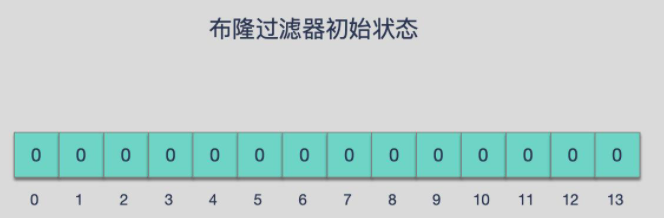
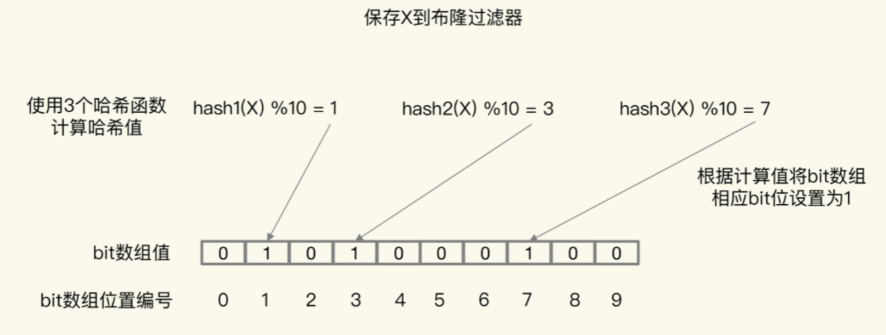

# 布隆过滤器

布隆过滤器由一个初值都为 0 的 bit 数组和 N 个哈希函数组成，可以用来快速判断某个数据是否存在。 

标记某个数据存在时（例如，数据已被写入数据库），布隆过滤器会通过三个操作完成标记：

1. 使用 N 个哈希函数，分别计算这个数据的哈希值，得到 N 个哈希值；
2. 把这 N 个哈希值对 bit 数组的长度取模，得到每个哈希值在数组中的对应位置；
3. 把对应位置的 bit 位设置为 1，这就完成了在布隆过滤器中标记数据的操作。

如果数据不存在（例如，数据库里没有写入数据），我们也就没有用布隆过滤器标记过数据，那么，bit 数组对应 bit 位的值仍然为 0。

当需要查询某个数据时，我们就执行上面的计算过程，先得到这个数据在 bit 数组中对应的 N 个位置。紧接着，我们查看 bit 数组中这 N 个位置上的 bit 值。只要这 N 个 bit 值有一个不为 1，这就表明布隆过滤器没有对该数据做过标记，所以，查询的数据一定没有在数据库中保存。

**主要特点：**

* 高效地插入和查询，占用空间少，返回的结果是不确定性的。
* 可以添加元素，但是不能删除元素，因为删掉元素会导致误判率增加。
* 一个元素判断结果为存在，但是元素不一定存在（可能是其他 value 的 hash 函数填充的），但是判断为不存在的时候则一定不存在。

**布隆过滤器误判率？为什么不能删除元素？**

> 布隆过滤器的误判是指多个输入经过哈希之后在相同的 bit 位置 1 了，这样就无法判断究竟是哪个输入产生的，因此误判的根源在于相同的 bit 位被多次映射且置 1。
>
> 这种情况也造成了布隆过滤器的删除问题，因为布隆过滤器的每一个 bit 并不是独占的，很有可能多个元素共享了某一位。如果我们直接删除这一位的话，会影响其他的元素。

‍
