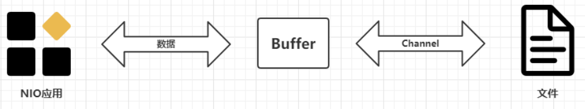
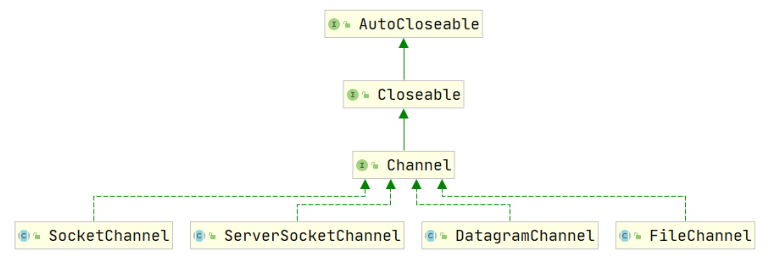

# BIO与NIO与AIO

## BIO

BIO全称是Basic（基本） IO，Java1.4之前建立网络连接只能使用BIO，处理数据是以字节为单位。

## NIO

**java.nio 全称Java Non-Blocking IO**，JDK1.4开始，改进后的IO，NIO和BIO的目的和作用相同，但是实现方式不同

1. 效率不同：BIO以**字节**为单位处理数据，NIO以**块**为单位处理数据 
2. 是否阻塞：BIO是阻塞式的，NIO是非阻塞式的
3. 数据流向：BIO单向、NIO双向

**NIO 主要有三大核心部分**

1. Channel通道
2. Buffer缓冲区
3. Selector选择器

NIO基于Channel和Buffer进行操作，数据总是从Channel读取到Buffer中，或从Buffer写入到Channel，Selector监听多个Channel的事件，使用单个线程就可以监听多个客户端Channel

### 文件IO

**Buffer（缓冲区）：**是一个缓冲容器（底层是数组）内置了一些机制能够跟踪和记录缓冲区的状态变化。

**Channel（通道）：**提供从文件、网络读取数据的通道， 读取或写入数据都必须经由 Buffer

#### Buffer

**在NIO中 Buffer 顶层抽象父类，表示一个缓冲区，Channel 读写数据都是放入 Buffer 中进行**

对于 Java 中的基本数据类型， 都有一个 Buffer 类型与之相对应，最常用的自然是ByteBuffer 类（字节缓冲），**该类主要方法如下：**

- ByteBuffer put(byte[] b); 存储字节数据到Buffer
- byte[] get(); 从Buffer获得字节数据
- byte[] array(); 把Buffer数据转换成字节数组
- ByteBuffer allocate(int capacity); 设置缓冲区的初始容量
- ByteBuffer wrap(byte[] array); 把数组放到缓冲区中
- **Buffer flip(); 翻转缓冲区，重置位置到初始位置**

**flip()方法的作用：**翻转缓冲区，在缓冲区里有一个指针从头（pos）写到尾（lim）。默认的pos是缓冲区内元素size，lim是缓冲区大小。当从缓冲区向通道去写时，是从pos位置去写，写到lim，这样就得不到数据。所以要将pos=lim，pos=0再写。

#### Channel

**在NIO中Channel是一个接口，表示通道，通道是双向的，可以用来读，也可以用来写数据**

常用的 Channel 类有：FileChannel、DatagramChannel、ServerSocketChannel、SocketChannel

- FileChannel： 用于文件的数据读写
- DatagramChannel： 用于 UDP 的数据读写
- ServerSocketChannel 和 SocketChannel： 用于 TCP 的数据读写

FileChannel 主要用来对本地文件进行 IO 操作，**主要方法如下**：

- int read(ByteBuffer dst)：从Channel读取数据并放到Buffer中
- int write(ByteBuffer src)：把Buffer的数据写到Channel中
- long transferFrom(ReadableByteChannel src, position, count)：从目标Channel中复制数据到当前Channel
- long transferTo(position, count, WritableByteChannel target)：把数据从当前Channel复制给目标Channel

### 网络IO

JavaNIO中网络通道是**非阻塞IO，基于事件驱动**，很适合需要维持大量连接，但数据交换量不大的场景，例如：RPC、即时通讯、Web服务器等。

#### Selector选择器

Selector选择器也叫**多路复用器**

- NIO三大核心组件之一
- 用于检测多个注册Channel上是否有事件发生（读、写、连接）如果有就获取事件，并对每个事件进行处理
- 只需一个单线程就可以管理多个Channel，也就是多个连接。
- 只有连接真正有读写事件时，才会调用方法来处理，大大降低了系统分配线程与线程上下文切换的开销

**常用方法：**

- Selector open()：开启一个Selector
- int select(long timeout)：监控所注册的通道
- selectedKeys()：从Selector获取所有SelectionKey

#### SelectionKey

**代表了 Selector 和网络SocketChannel的注册关系**

**一共四种：**

- OP_ACCEPT：有新的网络连接可以 accept
- OP_CONNECT：代表连接已经建立
- OP_READ和OP_WRITE：代表了读和写操作

**常用方法：**

- Selector selector()：得到与之关联的 Selector 对象
- SelectableChannel channel()：得到与之关联的通道
- Object attachment()：得到与之关联的共享数据
- boolean isAcceptable()：是否可接入
- boolean isReadable()：是否可以读
- boolean isWritable()：是否可以写

#### ServerSocketChannel

用来在Server端监听新的Client的Socket连接

**常用方法：**

- ServerSocketChannel open()：开启一个ServerSocketChannel 通道
- ServerSocketChannel bind(SocketAddress local)：设置Server端口号
- SelectableChannel configureBlocking(block)：设置阻塞模式，false表示采用非阻塞模式
- SocketChannel accept()：接受一个连接，返回值代表这个连接的Channel对象
- SelectionKey register(Selector sel, int ops)：注册Selector并设置监听事件

#### SocketChannel

网络IO通道，具体负责进行读写操作

**常用方法：**

- SocketChannel open()：得到一个 SocketChannel 通道
- SelectableChannel configureBlocking(block)：设置阻塞模式，false表示采用非阻塞模式
- boolean connect(SocketAddress remote)：连接服务器
- boolean finishConnect()：如果connect连接失败，接下来就要通过本方法完成连接
- int write(ByteBuffer src)：往通道里写数据
- int read(ByteBuffer dst)：从通道里读数据
- SelectionKey register(Selector sel, ops, att)：注册Selector并设置监听事件
- void close()：关闭通道

#### Selector与SelectionKey、ServerSocketChannel、SocketChannel的关系

- Server端有一个Selector对象
- ServerSocketChannel通道要注册给selector， selector#accept方法负责接收Client连接请求
- 有一个Client连接过来， Server就会建立一个SocketChannel
- Selector会监控所有注册的SocketChannel ，检查通道中是否有事件发生【连接、断开、读、写等事件】
- 如果某个SocketChannel有事件发生则做相应的处理

## AIO

JDK 7 引入了 Asynchronous IO，即 AIO，叫做**异步不阻塞的 IO**，也可以叫做NIO2。在进行 IO 编程中，常用到两种模式：**Reactor模式和 Proactor模式。**

- NIO采用 Reactor 模式：**当有事件触发时，服务器端得到通知，进行相应的处理**。
- AIO采用 Proactor模式：引入**异步通道**的概念，简化了程序编写，一个有效的请求才启动一个线程，它的特点是**先由操作系统完成后，才通知服务端程序启动线程去处理**，一般适用于连接数较多且连接时间较长的应用

## IO对比总结

| 对比     | BIO                                                          | NIO                                                          | AIO                                                          |
| -------- | ------------------------------------------------------------ | ------------------------------------------------------------ | ------------------------------------------------------------ |
| IO方式   | 同步阻塞                                                     | 同步非阻塞（多路复用）                                       | 异步非阻塞                                                   |
| 可靠性   | 差                                                           | 好                                                           | 好                                                           |
| 吞吐量   | 低                                                           | 高                                                           | 高                                                           |
| 适用场景 | 连接数目较小且固定的架构                                     | 适用于连接数目多且连接比较短（轻操作）的架构                 | 使用于连接数目多且连接比较长（重操作）的架构                 |
| 举例     | 食堂排队取餐，排队等着，啥都干不了，到你了选餐，付款，然后找位子吃饭 | 下馆子，点完餐，就去商场玩儿了。玩一会儿，就回饭馆问一声：好了没 | 海底捞外卖火锅，打电话订餐。海底捞会说，我们知道您的位置，一会给您送过来，请您安心工作。 |

