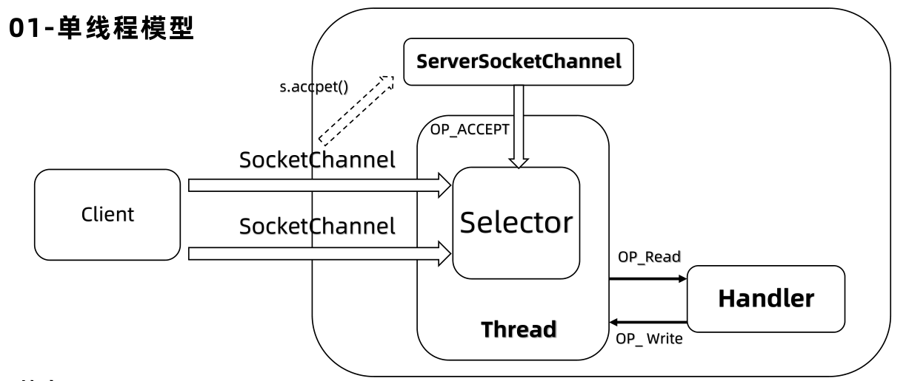
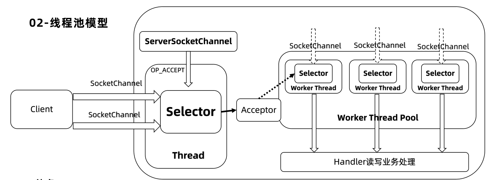
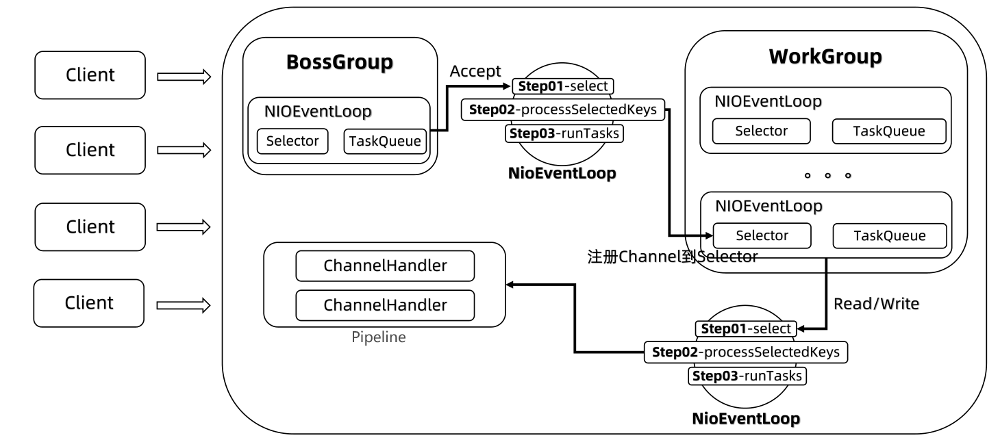
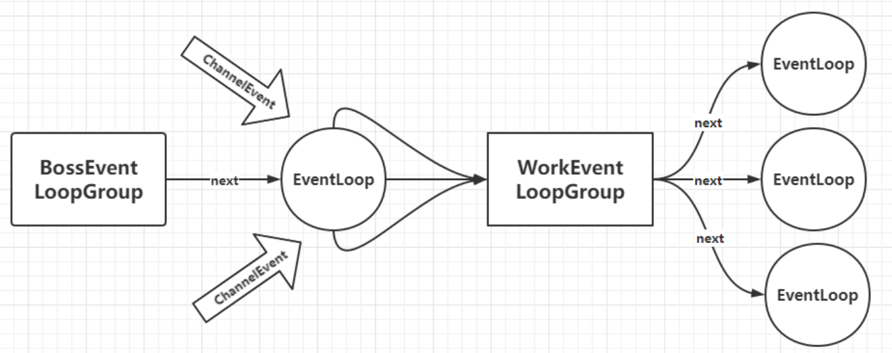
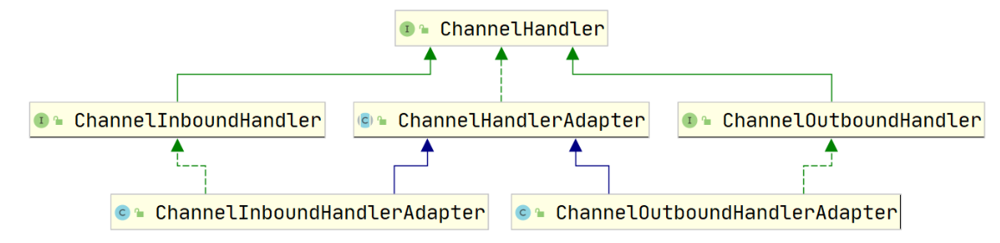
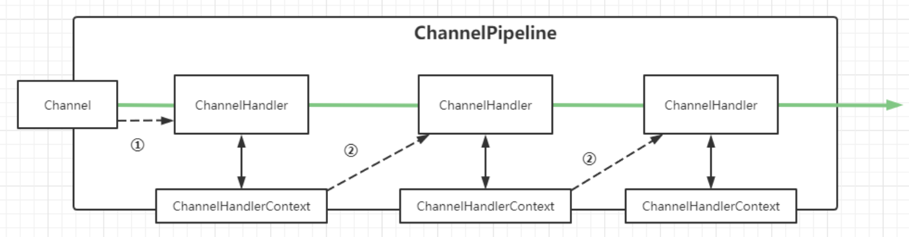

# Netty

## 概述

### 什么是 Netty

**Netty 是一个被广泛使用的 Java 网络应用编程框架，** Netty 框架帮助开发者快速、简单的实现一个客户端/服务端的网络应用程序。Netty 利用 Java 语言的 NIO 网络编程的能力，并隐藏其背后的复杂性从而提供了简单易用的 API。

### 特点

- API 简单易用：支持阻塞和非阻塞式的 socket
- 基于事件模型：可扩展性和灵活性更强
- 高度定制化的线程模型：支持单线程和多线程
- 高通吐、低延迟、资源占用率低
- 完整支持 SSL 和 TLS

### 应用场景

- 互联网行业：分布式系统远程过程调用，高性能的 RPC 框架
- 游戏行业：大型网络游戏高性能通信
- 大数据：Hadoop 的高性能通信和序列化组件 Avro 的 RPC 框架

## 线程模型

### 单线程模型

**特点：** 通过 IO 多路复用，一个线程搞定所有 Client 连接，代码简单，清晰明了，如果 Client 连接数量过多则无法支撑

### 线程池模型

**特点：** 通过 IO 多路复用，一个线程专门负责连接，线程池负责处理请求，大多数场景下，此模型都能满足网络编程需求

### Netty 线程模型

#### 各组件间的关系

Netty 抽象出两组线程池：**BossGroup、WorkerGroup**，它们的类型都是 NioEventLoopGroup，相当于一个事件循环组

- BossGroup：专门负责接收客户端连接
- WorkerGroup：专门负责网络读写操作
- NioEventLoopGroup：可以有多个线程，即含有多个 NioEventLoop
- NioEventLoop：表示一个不断循环的执行处理任务的 **线程**

**NioEventLoop：**

- 每个 NioEventLoop 中包含有一个 Selector，一个 taskQueue

  - Selector 上可以注册监听多个 NioChannel，也就是监听 Socket 网络通信
  - 每个 NioChannel 只会绑定在唯一的 NioEventLoop 上
  - 每个 NioChannel 都绑定有一个自己的 ChannelPipeline

- NioEventLoop 内部采用串行化（Pipeline）设计：责任链模式，消息读取 ==> 解码 == > 处理（handlers） ==> 编码 == > 发送，始终由 IO 线程 NioEventLoop 负责

#### 一个 Client 连接的执行流程

1. Boss 的 NioEventLoop 循环执行步骤：

	1. 轮询 accept 事件
	2. 处理 accept 事件：与 client 建立连接，生成 NioSocketChannel ，并将其注册到某个 worker 的 NIOEventLoop 的 selector，
	3. 处理任务队列的任务 ， 即 runTasks

2. Worker 的 NIOEventLoop 循环执行步骤：

	1. 轮询 read、write 事件
	2. 在对应 NioSocketChannel 中，处理业务相关操作（ChannelHandler）
	3. 处理任务队列的任务，即 runTasks

1. 每个 Worker 的 NioEventLoop 处理业务时会使用管道 Pipeline。Pipeline 中包含了 Channel，通过管道可以获取到对应 Channel，Channel 中维护了很多的 Handler 处理器。

## 核心 API

### ServerBootstrap

Netty 中的服务端启动助手，通过它可以完成服务端的各种配置

**常用方法**

- ServerBootstrap group(parentGroup , childGroup)：该方法用于设置两个 EventLoopGroup，连接线程组和工作线程组
- B channel(Class <? extends C> channelClass)：**该方法用来设置服务端或客户端通道的实现类型**
- B option(ChannelOption option, T value)：用来给 **ServerChannel 添加配置**
- ServerBootstrap childOption(ChannelOption childOption, T value)：用来给 **接收通道添加配置**
- ServerBootstrap childHandler(ChannelHandler childHandler)：该方法用来设置业务处理类（自定义 handler）
- ChannelFuture bind(int inetPort) ：该方法用于 **设置占用端口号**

### Bootstrap

Netty 中的客户端启动助手，通过它可以完成客户端的各种配置

**常用方法**

- B group(EventLoopGroup group)：该方法用来设置客户端的 EventLoopGroup
- B channel(Class <? extends C> channelClass)：该方法用来 **设置服务端或客户端通道的实现类型**
- ChannelFuture connect(String inetHost, int inetPort) ：该方法用来 **配置连接服务端地址信息**，host: port

### EventLoopGroup

在 Netty 服务端编程中，一般需要提供两个 EventLoopGroup：

1. BossEventLoopGroup 专门负责接收客户端连接
2. WorkerEventLoopGroup 专门负责网络读写操作

Netty 为了更好的利用多核 CPU 资源，一般会有多个 EventLoop 同时工作，每个 EventLoop 维护着一个 Selector 实例。EventLoopGroup 提供 

next 接口，可以从组里面按照一定规则获取其中一个 EventLoop 来处理任务。

**EventLoopGroup 本质是一组 EventLoop，池化管理的思想。**

通常一个服务端口即一个 ServerSocketChannel 对应一个 Selector 和一个 EventLoop 线程，BossEventLoop 负责接收客户端的连接并将

SocketChannel 交给 WorkerEventLoopGroup 来进行 IO 处理。

**如下图所示**

- BossEventLoopGroup 通常是单线程的 EventLoop，EventLoop 维护着一个注册了 ServerSocketChannel 的 Selector 实例
- Boss 的 EventLoop 不断轮询 Selector 将连接事件分离出来，通常是 OP_ACCEPT 事件， 然后将接收到的 SocketChannel 交给 WorkerEventLoopGroup
- WorkerEventLoopGroup 会由 next 选择其中一个 EventLoop 来将这个 SocketChannel 注册到其维护的 Selector 并对其后续的事件进行处理

**常用方法**

- NioEventLoopGroup()：构造方法
- Future <?> shutdownGracefully()：断开连接，关闭线程

### ChannelHandler 及其实现类

ChannelHandler 接口定义了许多事件处理的方法，我们通过重写这些方法实现业务功能。API 关系如下图所示

我们需要自定义一个 Handler 类去继承 ChannelInboundHandlerAdapter，然后通过重写相应方法实现业务逻辑，一般需要重写的方法：

- channelActive(ChannelHandlerContext ctx)：通道就绪事件
- channelRead(ChannelHandlerContext ctx, Object msg)：通道读取数据事件
- channelReadComplete(ChannelHandlerContext ctx) ：数据读取完毕事件
- exceptionCaught(ChannelHandlerContext ctx, Throwable cause)：通道发生异常事件

### ChannelPipeline

ChannelPipeline 是一个 **Handler 的集合**，它负责处理和拦截 inbound 或者 outbound 的事件和操作，相当于一个贯穿 Netty 的链（责任链模式）。

- 01-事件传递到 ChannelPipeline 中的第一个 ChannelHandler
- 02-ChannelHandler 使用分配的 ChannelHandlerContext 将事件传递给 ChannelPipeline 中的下一个 ChannelHander

上图绿线的线串起来的就是 Pipeline，它包含 3 个处理不同业务的 ChannelHandler，依次通过这三个 ChannelHandler。因为这 3 个 ChannelHandler 不知道彼此，所以要用 ChannelHandlerContext 上下文来说明，ChannelHandlerContext 包含 ChannelHandler、Channel、pipeline 的信息。

- ChannelPipeline addFirst(ChannelHandler... handlers)：把业务处理类（handler）添加到 Pipeline 链中的第一个位置
- ChannelPipeline addLast(ChannelHandler... handlers)：把业务处理类（handler）添加到 Pipeline 链中的最后一个位置

### ChannelHandlerContext

ChannelHandlerContext 是事件处理器上下文对象，Pipeline 链中的实际处理节点。 每个处理节点 ChannelHandlerContext 中包含一个具体的事件处理器 ChannelHandler，同时 ChannelHandlerContext 中也绑定了对应的 Pipeline 和 Channel 的信息，方便对 ChannelHandler 进行调用。

**常用方法**

- ChannelFuture close()：关闭通道
- ChannelOutboundInvoker flush()：刷新
- ChannelFuture writeAndFlush(Object msg) ：将数据写到 ChannelPipeline 中当前 ChannelHandler 的下一个 ChannelHandler 开始处理（出栈交给下一个 handler 将继续处理）

### ChannelOption

Netty 在创建 Channel 实例后，一般都需要设置 ChannelOption 参数。ChannelOption 是 Socket 的标准化参数而非 Netty 的独创

**常配参数**

- ChannelOption.SO_BACKLOG：用来初始化服务器可连接队列大小，对应 TCP/IP 协议 listen 函数中的 backlog 参数。

  - 服务端处理客户端连接请求是顺序处理的，所以同一时间只能处理一个客户端连接。
  - 如果请求连接过多，服务端将不能及时处理，多余连接放在队列中等待，backlog 参数指定了等待队列大小。

- ChannelOption.SO_KEEPALIVE：**连接是否一直保持**（是否长连接）。

### ChannelFuture

ChannelFuture 表示 Channel 中异步 IO 操作的未来结果，在 Netty 中异步 IO 操作都是直接返回，调用者并不能立刻获得结果，但是可以通过ChannelFuture 来获取 IO 操作的处理状态。

Netty 异步非阻塞处理事件，如果事件很费时，会通过 Future 异步处理，不会阻塞。

**常用方法：**

- Channel channel()：返回当前正在进行IO操作的通道
- ChannelFuture sync()：等待异步操作执行完毕

### Unpooled 

Netty 提供的一个专门用来操作缓冲区的工具类

**常用方法**

- ByteBuf copiedBuffer(CharSequence string, Charset charset)：通过给定的数据和字符编码返回一个 ByteBuf 对象（类似于 NIO 中的 ByteBuffer 对象）

