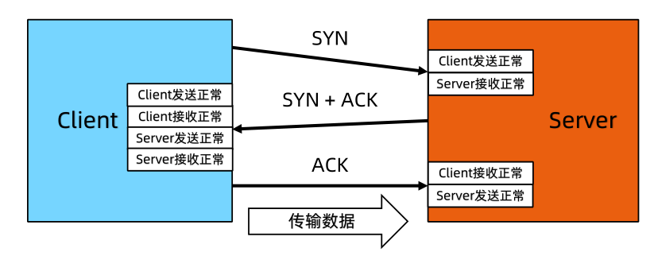
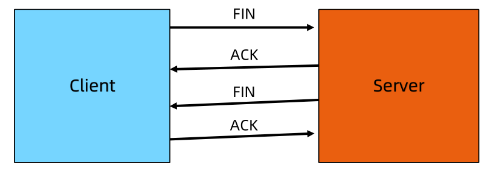
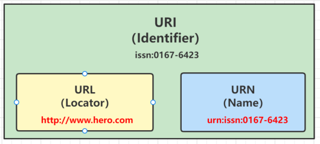
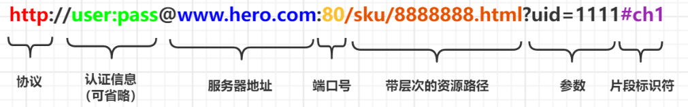

# 网络编程基础

## TCP与UDP协议

### TCP

**TCP：传输控制协议 (Transmission Control Protocol)**

TCP协议是**面向连接**的通信协议，即传输数据之前，在发送端和接收端建立逻辑连接，然后再传输数据，它提供了两台计算机之间可靠无差错的数据传输。**建立一次连接完成三次握手后**，客户端和服务器就可以开始进行数据传输了。传输完成之后，通过**四次挥手关闭连接**。由于这种面向连接的特性，TCP协议可以保证传输数据的安全，所以应用十分广泛，例如下载文件、浏览网页等。

### UDP

**UDP：用户数据报送协议(User Datagram Protocol)**

UDP协议是一个**面向无连接**的协议。传输数据时，不需要建立连接，不管对方端服务是否启动，直接将数据、数据源和目的地都封装在数据包中，直接发送。每个数据包的大小限制在64k以内。它是不可靠协议，因为无连接，所以传输速度快，但是容易丢失数据。日常应用中，例如视频会议、直播等。

## TCP的三次握手

三次握手：TCP协议在发送数据的准备阶段，客户端与服务器之间的三次交互，以保证连接的可靠

- 1次握手：Client发送带有 SYN 标志的数据包给Server
- 2次握手：Server发送带有 SYN/ACK 标志的数据包给Client
- 3次握手：Client发送带有 ACK 标志的数据包给Server



### 为什么要三次握手

三次握手的目的是**建立可靠的通信信道，双方确认自己与对方的发送与接收是正常的**

- 1次握手： Client 什么都不能确认； Server 确认对方发送正常，自己接收正常
- 2次握手： Client 确认自己发送接收正常，对方发送接收正常；
- 3次握手： Server 确认自己发送正常，对方接收正常

## TCP-四次挥手

数据传输完毕，断开⼀个 TCP 连接则需要四次挥手：

- 1次挥手：Client 发送⼀个 FIN 给 Server，用来关闭客户端到服务器的数据传送
- 2次挥手：Server 收到这个 FIN 给 Client 发回一个 ACK，确认序号为收到的序号加1
- 3次挥手：Server 关闭与客户端的连接，并发送⼀个 FIN 给 Client
- 4次挥手：Client 收到这个 FIN 给 Server 发回一个 ACK，并将确认序号设置为收到序号加1



### 为什么要四次挥手

数据传输完毕，**任何一方可以发送结束连接的通知，然后进入半关闭状态**。另一方没有数据在发送的时候，则发出结束连接的通知，对方确认后，完全关闭连接。

## HTTP1.0与HTTP1.1的区别

### 长连接

HTTP/1.0默认使用的是短连接，HTTP1.1默认使用长连接，`Connection：keep-alive`

HTTP/1.1长连接有非流水线方式和流水线（pipelining）方式

- 流水线方式：客户在收到HTTP的响应报文之前就能接着发送新的请求报文，其实就是并行发送请求
- 非流水线方式：客户在收到前一人响应后才能发送下一个请求，其实就是串行发送请求

### 错误状态码

HTTP1.1新增**24**个错误状态响应码

### 缓存

HTTP1.0缓存判断标准单一；HTTP1.1引入了更多的缓存控制策略

### 断点续传

HTTP1.0不支持断点续传，浪费带宽；HTTP1.1加入断点续传支持，允许只请求资源的某个部分，充分利用带宽和连接

## HTTP与HTTPS的区别

### 端口

HTTP默认端口80；HTTPS默认端口443

### 协议

HTTP的协议：http://；HTTPS的协议： https://

### 安全性与资源消耗

- HTTP协议运行在TCP之上，所有传输的内容都是明文，HTTP安全性没有HTTPS高，资源消耗相比于HTTPS更低
- HTTPS是运行在SSL/TLS之上的HTTP协议，HTTPS = HTTP + 加密 + 认证 + 完整性保护
- HTTP是明文传输数据，HTTPS是加密传输内容
- HTTPS传输内容加密使用**对称加密算法**，对称加密的**密钥采用非对称加密**

## URI与URL的区别

- **URI（Uniform Resource Identifier）统一资源标志符**：资源抽象的定义，不管用什么方法表示，只要能定位一个资源就叫URI
- **URL（Uniform Resource Locator）统一资源定位符**，是一种具体的URI，在用地址定位
- **URN（Uniform Resource Name）统一资源名称**，也是一种具体的URI，在用名称定位



**例如：**

```markdown
去朝阳区找雄雄这个人，人就是一个资源（URI）
如果用地址（URL）：来广营叶青大厦北园1层1号房的主人就是
如果用手机号+名字（URN）：18466660000 + 雄雄 
```

**绝对URL地址的构成如下图：**



- **协议：**使用 http: 或 https: 等协议方案名获取访问资源时要指定协议类型。不区分字母大小写，最后附一个冒号（:）
- **登陆信息（认证）**：指定用户名和密码作为从服务器端获取资源时必要的登录信息（身份认证），可省略
- **服务器地址**：必须指定访问的服务器地址。地址可以是域名，可以是IPv4地址192.168.1.1或172.17.187.80，也可以IPv6地址[0:0:0:0:0:0:0:1] 用方括号括起来
- **端口号**：指定服务器端口号，也可省略，若用户省略则使用默认端口号80
- **带层次的文件路径**：指定服务器上的文件路径来定位特指的资源
- **查询参数**：针对已指定的文件路径内的资源，可以使用查询字符串传入任意参数，可省略
- **片段标识符**：使用片段标识符通常可标记出已获取资源中的子资源，也就是文档内的某位置，可省略


